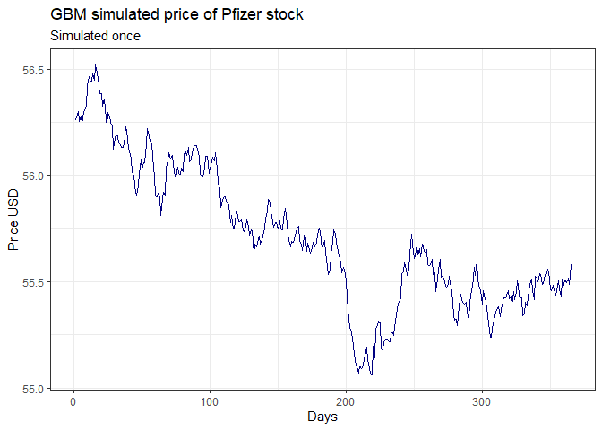

APT - Asset Pricing Theory
================
Urban Merhar
11.1.2022

# Geometric Brownian motion

In this project I use *geometric Brownian motion* to simulate a stock
price a year in advance.

Data was aquired from [nasdaq](https://www.nasdaq.com/). For the project
I choose the stock of [Pfizer, Inc. Common
Stock](https://www.pfizer.com/) as the company is very relevant in this
covid times.

# Stochastic random process

For the final project in *Asset Pricing Theory* course I decided to
simulate stock prices using *geometric Brownian motion*.

*Geometric Brownian motion* is a stochastic process in continuous time.
The process is used in mathematical finance to model stock prices.
*Geometric Brownian motion* is represented by the stochastic
differential equation.

$dS_{t} = \mu S_{t} dt + \sigma S_{t} dW_{t}$.

Coefficients $\mu$
and
$\sigma$
are constants and represent the percentage drift and percentage
volatility of the stock. The first part of the equation is deterministic
and the second part is unpredictable as it contains a random component
$dW_{t}$
which is the *Brownian motion*.

Dividing the equation with
$S_{t}$
and using *Ito’s Lemma* leads us to the solution.

$S_{t} = S_{0} \ e^{(\mu - \frac{\sigma^{2}}{2})t + \sigma  W_{t}}$, where $W_{t} \sim N(0, t)$.

We can use this solution of the *geometric Brownian motion* model to
simulate stock prices. Here
$S_{t}$
is the price of stock at time
$t$.
We need historical data of the price of stock. Out of this data we
estimate *percentage drift*
$\hat{\mu}$
and *percentage volatility*
$\hat{\sigma}$.
Where we firstly calculate log-returns for each
$t = 2, \dots, T: \ \ Z_{t} = ln \Big(\frac{S_{t}}{S_{t-1}} \Big)$.

Now we can estimate:

-   $\hat{\mu} = \frac{1}{T - 1} \sum_{t=2}^{T} Z_{t}"$,
-   $\hat{\sigma} = \sqrt{var(Z_{t}) \ \tau}$,

where
$T$
is the number of periods and
$\tau$
is the number of trading days between two periods.

With all of the above we can simulate stock prices using *geometric
Brownian motion*.

## Code

The first function `GBMmodel` uses a vector of stock prices in the past
and calculates
$Z_{t} = ln \Big(\frac{S_{t}}{S_{t-1}} \Big)$.
It returns the vector
$Z_{t}, \ t=2, \dots, T$.

``` r
# stock_prices <- vector of stock prices in the past
# returns Z.t for calculation of mu.hat and sigma.hat
GBMmodel <- function(stock_prices){
  Z.t <- c()
  for(price in stock_prices){
    for(j in c(1:length(price)-1)){
      Z.t <- append(Z.t, log(price[j]/price[j+1]))
    }
  }
  return(Z.t)
}
```

Next is the code to calculate
$Z_{t}$
= `Z.t`,
$\hat{\mu}$
= `mu.hat` and
$\hat{\sigma}$
= `sigma.hat` for given data.

``` r
# calculate Z.t, mu.hat, sigma.hat
# df[2] is the vector of stock prices from my data (look at chapter Data)
# number of rows in our data is the number of trading days T
# to simplify I used 1 for tau
Z.t <- GBMmodel(df[2])
mu.hat <- 1/(nrow(df) - 1) * sum(Z.t)
sigma.hat <- sqrt(var(Z.t)*1)
```

Into function `GBMprediction` we give percentage drift, percentage
volatility and number of days we want to simulate. By default, the
number of days is set to
$365$.
The function then simulates stock prices for our given data using
*geometric Brownian motion*. For
$W_{t} \sim N(0, t)$
the function uses an inbuilt function `rnom`. The function returns a
vector of simulated stock prices.

``` r
# returns a vector of predictions for the future using GBM
# mu.hat
# sigma.hat
GBMprediction <- function(mu.hat, sigma.hat, days = 365){
  prediction.time <- 1:days
  predicted.price <- c()
  for(i in prediction.time){
    if(length(predicted.price) < 1){
      last.price <- df$Price[1]
    } else {
      last.price <- predicted.price[length(predicted.price)]
      }
    predicted.price <- append(predicted.price,
                              last.price * 
                              exp((mu.hat - sigma.hat^2 / 2) * 1/days +
                                  sigma.hat * rnorm(1) * sqrt(1/days)))
  }
  return(predicted.price)
}
```

The last function `GBM.simulated.data` returns a data frame of
$N$
simulations using the function `GBMprediction`. Inputs are:

-   `N` - number of simulations,
-   `start` - date of start of simulation (default “2022-1-11”),
-   `end` - end date of simulation (default “2023-01-10”),
-   `mu.hat` - for `GBMprediction`,
-   `sigma.hat` - for `GBMprediction`.

``` r
# Create simulated data
# returns a data frame of N simulations
#######################################
# N <- number of simulations
# start <- date of start of simulation (default "2022-1-11")
# end <- end date of simulation (default "2023-01-10")
# mu.hat
# sigma.hat
# date: year-month-day
GBM.simulated.data <- function(N, start = "2022-1-11", end = "2023-01-10",
                               mu.hat, sigma.hat){
  sim.df <- data.frame(future.date = seq(as.Date("2022-1-11"), 
                                         as.Date("2023-01-10"), 
                                         by="days"))
  for(i in 1:N){
    new <- as.data.frame(GBMprediction(mu.hat, sigma.hat))
    sim.df[ , ncol(sim.df) + 1] <- new
    colnames(sim.df)[ncol(sim.df)] <- paste0("sim", i)
  }
  return(sim.df)
}
```

Returned data frame looks like:

| Future date                                                                                                | Simulation 1                                                                                                 | Simulation 2                                                                                                 | …                                                                                                          | Simulation N                                                                                                 |
|------------------------------------------------------------------------------------------------------------|--------------------------------------------------------------------------------------------------------------|--------------------------------------------------------------------------------------------------------------|------------------------------------------------------------------------------------------------------------|--------------------------------------------------------------------------------------------------------------|
| Date $1$              | $S_{11}$ | $S_{21}$ | …                                                                                                          | $S_{N1}$ |
| Date $2$              | $S_{12}$ | $S_{22}$ | …                                                                                                          | $S_{N2}$ |
| $\vdots$ | $\vdots$   | $\vdots$   | $\vdots$ | $\vdots$   |
| Date $M$              | $S_{1M}$ | $S_{2M}$ | …                                                                                                          | $S_{NM}$ |

$S_{ij}$
is simulated value of simulation
$i$
on date
$j$,
where
$i \in [1,N]$
and
$j \in [1, M]$.

# Data

The data was acquired on *11.1.2022* on the website of
[](https://www.nasdaq.com/). For the project I choose the stock of
[](https://www.pfizer.com/) as the company is very relevant in this
covid times.

Historical prices of the pfizer stock can be found on the website
[](https://www.nasdaq.com/market-activity/stocks/pfe/historical). I
downloaded data for the Pfizer, Inc. Common Stock for the last *5* years
in *.csv* format and used the package *readr* to read the downloaded
data. Below are the first six rows of raw data displayed with the *head*
function.

``` r
head(raw.data)
```

    ## # A tibble: 6 x 6
    ##   Date                `Close/Last`   Volume Open   High   Low   
    ##   <dttm>              <chr>           <int> <chr>  <chr>  <chr> 
    ## 1 2022-01-10 00:00:00 $56.24       34044650 $55.71 $56.26 $54.74
    ## 2 2022-01-07 00:00:00 $55.72       27703370 $55.36 $55.77 $54.63
    ## 3 2022-01-06 00:00:00 $54.84       37000390 $55.16 $55.63 $54.49
    ## 4 2022-01-05 00:00:00 $55.63       52956420 $55.84 $56.44 $55.37
    ## 5 2022-01-04 00:00:00 $54.53       66993080 $56.22 $56.43 $53.94
    ## 6 2022-01-03 00:00:00 $56.65       57253150 $58.5  $58.55 $56.34

We have 6 columns:

1.  `Date` date of trading,
2.  `Close/Last` last price,
3.  `Volume` volume of stocks,
4.  `Open` open price,
5.  `High` high price,
6.  `Low` low price.

For the simulation i only need the `Date` and `Close/Last` as I decided
to use the latter for the price of the stock.

The data was imported using `read_csv` function. After that I narrowed
the columns to `Date` and `Price`. The last thing in cleaning the data
was to get rid of the `$` sign and change the class of `Price` from
character to double.

``` r
# Pfizer stock data for the last 5 years
raw.data <- read_csv("HistoricalData_1641895850651.csv",
                     col_types = cols(Date = col_datetime(format = "%m/%d/%Y"), 
                                  "Close/Last" = col_character(), Volume = col_integer(), 
                                  Open = col_character(), High = col_character(), 
                                  Low = col_character()))

# For the price of stock I will take "Close/Last"
df <- raw.data[1:2]
df <- rename(df, "Price" = "Close/Last")

# get rid of $ and change char to double
df$Price <- as.numeric(gsub("\\$", "", df$Price))
```

The end result of cleaning the data is displayed below.

``` r
head(df)
```

    ## # A tibble: 6 x 2
    ##   Date                Price
    ##   <dttm>              <dbl>
    ## 1 2022-01-10 00:00:00  56.2
    ## 2 2022-01-07 00:00:00  55.7
    ## 3 2022-01-06 00:00:00  54.8
    ## 4 2022-01-05 00:00:00  55.6
    ## 5 2022-01-04 00:00:00  54.5
    ## 6 2022-01-03 00:00:00  56.6

After acquiring and cleaning the data we can visualize it. For
visualizing I used the *ggplot2* package.

``` r
# visualize the time series of selected data
ggplot(data = df, aes(x = Date, y = Price)) + 
  geom_line(color="navyblue") +
  labs(title = "Price of Pfizer stock", 
       subtitle = "Time series for the last 5 years", 
       caption = "Source: Nasdaq", 
       y = "Price USD") +
  scale_x_datetime(date_labels = "%Y",
                   date_breaks = "1 year") +
  theme_bw()
```

<!-- -->

# Simulation results

Now that we have the code and the data we can simulate the price of
stock using *geometric Brownian motion*.

Firstly lets calculate
$Z_{t}$
and then
$\hat{\mu}$
and
$\hat{\sigma}$.
With this we can simulate the price.

-   `predicted.price` is just one simulation of prices for the next
    $365$
    days.
-   `simulated.df` is data of
    $50$
    simulations.

``` r
# calculate Z.t, mu.hat, sigma.hat
Z.t <- GBMmodel(df[2])
mu.hat <- 1/(nrow(df) - 1) * sum(Z.t)
sigma.hat <- sqrt(var(Z.t)*1)

# simulate once
predicted.price <- GBMprediction(mu.hat, sigma.hat)

# simulate data
simulated.df <- GBM.simulated.data(50, mu.hat = mu.hat, sigma.hat = sigma.hat)
```

Now that we have simulated some data we should plot it. Let’s plot
`predicted.price` first, so we can see one simulation cleanly.

``` r
# visualize predicted price
ggplot() +
  geom_line(aes(x = 1:365, y = predicted.price),
            color = "navyblue") +
  labs(title = "GBM simulated price of Pfizer stock", 
       subtitle = "Simulated once",
       y = "Price USD",
       x = "Days") +
  theme_bw()
```

<!-- -->

To show that we will get a different simulation if we run the code again
let’s make a second `predicted.price` and plot it again.

``` r
# run a second simulation
predicted.price <- GBMprediction(mu.hat, sigma.hat)

# visualize predicted price
ggplot() +
  geom_line(aes(x = 1:365, y = predicted.price),
            color = "navyblue") +
  labs(title = "GBM simulated price of Pfizer stock", 
       subtitle = "Simulated once (second run)",
       y = "Price USD",
       x = "Days") +
  theme_bw()
```

<!-- -->

Now let’s see the graph of `simulated.df` where we simulated with
$N = 50$.

``` r
# graph of N simulations

# for loop didn't work for graphs... :(
# help for plotting multiple lines with multiple colors in one go
# help from: 
# https://www.geeksforgeeks.org/how-to-create-a-plot-using-ggplot2-with-multiple-lines-in-r/ 
library("reshape2")
data_long <- melt(simulated.df, id = "future.date", variable.name = "Simulation")
ggplot(data_long,            
       aes(x = future.date,
           y = value,
           color = Simulation)) +
  geom_line() +
  labs(title = "Simulation of Pfizer stock", 
       subtitle = "Simulations using Geometric Brownian motion", 
       y = "Price USD",
       x = "Date",
       name = "Simulation") +
  theme_bw()
```

<!-- -->

Since we have
$50$
simulations in one graph we cannot read specific simulations, but we can
see where all the simulations lead to together. So out of this graph and
the data we can look at specific values such as maximum and minimum at
the end of the simulation. We can also look at the mean and standard
deviation.

``` r
# at the end date:
# maximum
max(simulated.df[length(simulated.df),][-1])
```

    ## [1] 57.07191

``` r
# minimum
min(simulated.df[length(simulated.df),][-1])
```

    ## [1] 55.70046

``` r
# mean
mean(t(simulated.df[length(simulated.df),][-1]))
```

    ## [1] 56.3149

``` r
# median
median(t(simulated.df[length(simulated.df),][-1]))
```

    ## [1] 56.28668

``` r
# standard deviation
sd(simulated.df[length(simulated.df),][-1])
```

    ## [1] 0.3489561

For the end lets visualize the simulation together with the actual data.

``` r
# graph of past data + simulations
ggplot() +
  geom_line(data = data_long,
            aes(x = as.Date(future.date), y = value, color = Simulation)) +
  geom_line(data = df,
            aes(x = as.Date(Date), y = Price), color="navyblue") +
  labs(title = "Price of Pfizer stock and simulations", 
       subtitle = "Simulations using Geometric Brownian motion",
       y = "Price USD",
       x = "Date",
       name = "Simulation") +
  theme_bw() +
  theme(legend.position = "none")
```

<!-- -->

------------------------------------------------------------------------

[GitHub repository](https://github.com/urbanmerhar/APT).
